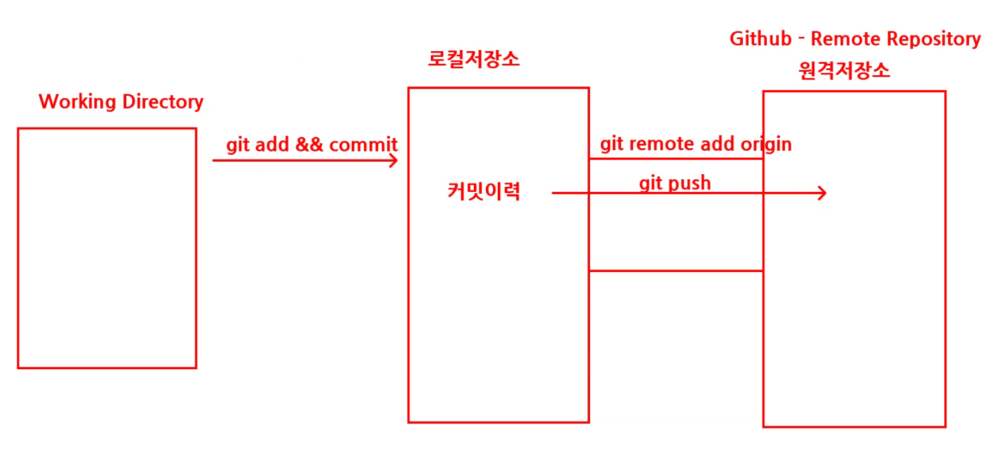
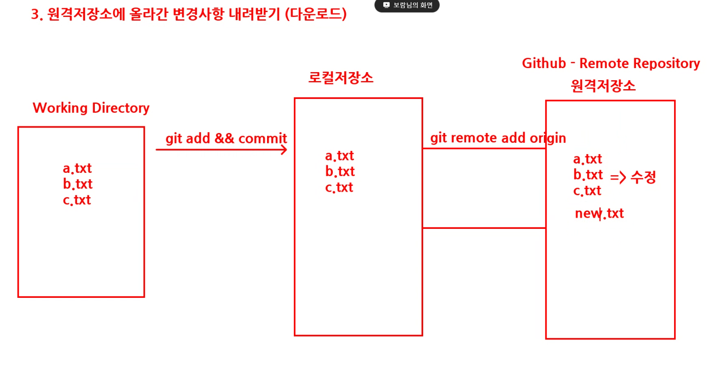
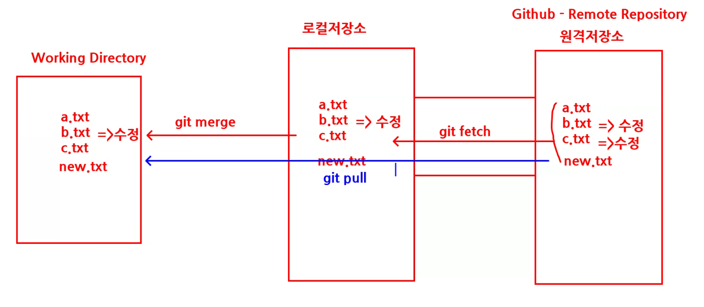

## Git & Github

- Git
  - 여러 개발자들의 코드 변경 추적 및 여러 버전 관리 가능
  - 로컬 컴퓨터에서 작동
- Github

  - git의 저장소 클라우드
  - 원격저장소를 통해 여러 개발자들이 협업할 수 있음
  - 이슈트래킹

- Git 초기 세팅

  - 다운로드 경로 : https://git-scm.com/
  - 사용자 설정 : 터미널에서 명령어 입력
    - 문자열이 1개일때 `-` 사용, 문자열이 여러개일때 `--` 사용
      예시 `git config --global user.name "사용자 이름"`
    - 커밋 기록 표시 이름, 커밋 기록 표시 이메일
    - 설정 확인 `git config --list`

- 터미널 화면 지우기 clear

## Git 명령어

### **1. 로컬 저장소(local repository) 설정**

작업폴더 내 우클릭(추가옵션표시) > open git bash here 클릭 (터미널 열기)

- 초기화 명령 `git init` (.git 생성 : 숨긴 폴더)

**구조 : 작업 폴더 > staging area > local repository**

**작업 폴더 > staging area**

- 로컬 저장소로 가기 전 staging area 로 보냄
- 보내는 명령어 `git add 파일명`
  - 여러개 파일을 한번에 보낼 때 폴더경로 확인 후 명령어 `git add .`
- 현재 상태 확인 `git status`

**staging area > local repository**

- 로컬 저장소로 보내는 명령어 `git commit`
  - commit 메시지를 작성하지 않았을 때 editor 창이 나타나면, 메시지 입력 후 `esc 키 + :wq` 입력
  - `git commit -m '커밋 메시지'` : 커밋 메시지를 한 줄로 입력
- 기록 확인 `git log`
- 기록 한줄로 보기 `git log --oneline`

head (작업 폴더) > main (브랜치명/로컬 저장소)

**로컬 저장소에는 commit 할 때마다 새로운 version 으로 기록**

- **이전 버전의 기록으로 복원 시** `git reset --hard 식별문자`
  - reset은 매우매우 신중히 할 것
  - 식별문자는 `git log`를 통해 확인 가능

### 2. 원격 저장소(Remote repository)

**로컬 저장소 > 원격 저장소**

- 로컬 저장소 > 원격 저장소 연동 설정
  - 연동 확인 명령어 `git remote`
  - 연동 명령어 `git remote add origin 원격저장소(github 주소 .git)`
  - 연동 경로 확인 `git remote -v`
- 로컬 저장소 데이터 > 원격 저장소로 업데이트
  - git push origin(원격지명) main(브랜치명)
  - `git push -u origin main` (업데이트를 지속적으로 동일한 원격지와 브랜치를 사용할 경우 -u 를 사용하여 1회 연결)

**주요 명령어 사이클**

- `git add .`
- `git commit`
  - git commit -m ‘메세지’
    - add 와 commit을 한 번에 사용할 때 (추적가능한 파일의 수정일 경우에만 해당)
      - git commit -m -a
      - git commit -am ‘메세지’
- `git push`

### 원격 저장소에서 수정 & 내려받기

**작업폴더와 로컬 저장소 동기화**

- 원격저장소에서 로컬저장소로 업데이트 `git fetch`
- 로컬저장소에서 작업폴더로 업데이트 `git merge`

- 원격저장소에서 로컬저장소와 작업폴더로 한 번에(fetch & merge) 보내기 `git pull`
- 원격저장소에서 a 파일 수정 & 작업폴더에서 b 파일 수정 시 `git pull` 시 충돌이 없음 (같은 파일 내 같은 라인을 수정 시 충돌이 일어남)

### 충돌이 일어났을 때

- pull을 받지 않은 상태에서 원격저장소 + 작업폴더에서 수정이 발생한 경우 충돌(error message)이 일어남
  - 작업폴어의 데이터를 commit 먼저 수행
    - `git commit -am '메세지'`
    - `git add .` + `git commit -m '메세지'`
  - `git pull`
  - 코드 확인 후 Accept change + 저장
  - `git add` + `git commit`
  - `git push`

### 데이터 복사 : CLONE

로컬 저장소가 비어있을 때 (새롭게 세팅해야 할 때) 원격저장소에 있는 데이터 내려받기 (미연동 상태)

- github 에서 원격지 주소 확인 (~~.git) 터미널에 붙여넣기(shift + insert)
  - `git clone 원격지주소`
  - 내려받기 폴더명 변경 시 `git clone 원격지주소 폴더명`
- 현재 위치 하위 폴더로 경로 변경 시
  - cd ./폴더명
