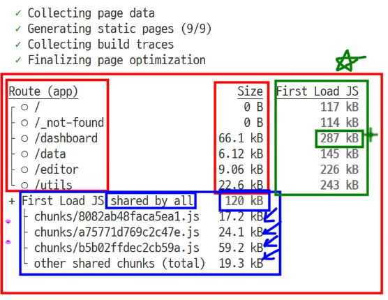

# 번들 최적화

## **빌드 결과 해석 (npm run build)**

**빌드 명령어 실행**

```bash
npm run build
```

**빌드 결과 예시**

```
Route (app)                         Size  First Load JS
┌ ○ /                                0 B         117 kB
├ ○ /_not-found                      0 B         114 kB
├ ○ /dashboard                   66.1 kB         287 kB  ⚠️
├ ○ /data                        6.29 kB         145 kB
├ ○ /editor                      9.24 kB         226 kB  ⚠️
└ ○ /utils                       22.8 kB         243 kB  ⚠️
+ First Load JS shared by all     120 kB ⚠️
  ├ chunks/8082ab48faca5ea1.js   17.2 kB
  ├ chunks/a75771d769c2c47e.js   24.1 kB
  ├ chunks/b5b02ffdec2cb59a.js   59.2 kB
  └ other shared chunks (total)  19.3 kB

○  (Static)  prerendered as static content
```



**📈 결과 해석 방법**

**1. Size (페이지별 크기)**

각 라우트(페이지)에 **고유하게 포함된** JavaScript 코드의 크기입니다.

```
├ ○ /dashboard                   66.1 kB  ← 대시보드에만 있는 코드
├ ○ /data                        6.29 kB  ← 데이터 페이지에만 있는 코드
├ ○ /editor                      9.24 kB  ← 에디터에만 있는 코드
└ ○ /utils                       22.8 kB  ← 유틸리티에만 있는 코드
```

**분석 포인트**:

- 큰 값 = 해당 페이지에 많은 고유 코드가 포함됨
- `/dashboard`가 66.1KB로 가장 큼 → Chart.js 관련 코드가 포함되어 있음

**2. First Load JS (초기 로딩 JavaScript)**

해당 페이지를 **처음 방문할 때 다운로드해야 하는 총 JavaScript 크기**입니다.

```
First Load JS = First Load JS shared by all + Size
```

<!--  -->

**예시:**

```
/dashboard: 66.1 kB (페이지 고유) + 120 kB (공유) = **186.1 kB**

하지만 실제로는 **287 kB**로 표시됨!
```

**왜 차이가 날까요?**

- 66.1 kB: `/dashboard` 페이지의 고유 코드
- 120 kB: 모든 페이지가 공유하는 기본 코드 (React, Next.js 런타임 등)
- **나머지 약 100 kB**: `/dashboard`에서 사용하는 외부 라이브러리 (Chart.js, lodash 등)

**분석 포인트**:

- `/dashboard`: **287 kB** ⚠️ 가장 무거움 (Chart.js 때문)
- `/editor`: **226 kB** ⚠️ 두 번째로 무거움 (Monaco Editor 때문)
- `/utils`: **243 kB** ⚠️ lodash, moment, axios 포함
- `/data`: **145 kB** 상대적으로 가벼움
- `/`: **117 kB** 메인 페이지는 가벼움

**3. First Load JS shared by all (모든 페이지가 공유하는 코드)**

```
+ First Load JS shared by all     120 kB
  ├ chunks/8082ab48faca5ea1.js   17.2 kB
  ├ chunks/a75771d769c2c47e.js   24.1 kB
  ├ chunks/b5b02ffdec2cb59a.js   59.2 kB  **⚠️ 가장 큰 청크**
  └ other shared chunks (total)  19.3 kB
```

**포함 내용**:

- React 및 React-DOM 코어 라이브러리
- Next.js 런타임 (라우팅, 페이지 로딩 등)
- 모든 페이지에서 공통으로 사용하는 코드

**분석 포인트**:

- 이 값은 **한 번만 다운로드**되고, 이후 페이지 이동 시 재사용됨
- 120 kB는 Next.js + React 애플리케이션의 기본 오버헤드
- `b5b02ffdec2cb59a.js` (59.2 kB)가 가장 큰 청크 → React 코어로 추정

## **🎯성능 지표 및 권장 기준**

**Google의 권장 기준**

- **First Load JS: < 100 KB**: 우수 ✅
- **First Load JS: 100-200 KB**: 보통 ⚠️
- **First Load JS: > 200 KB**: 개선 필요 ❌

  **현재 프로젝트 상태**

| 페이지       | First Load JS | 평가    | 문제 라이브러리               |
| ------------ | ------------- | ------- | ----------------------------- |
| `/`          | 117 kB        | ⚠️ 보통 | -                             |
| `/dashboard` | **287 kB**    | ❌ 나쁨 | Chart.js, lodash              |
| `/editor`    | **226 kB**    | ❌ 나쁨 | Monaco Editor, moment, lodash |
| `/utils`     | **243 kB**    | ❌ 나쁨 | lodash, moment, axios         |
| `/data`      | 145 kB        | ⚠️ 보통 | lodash                        |

<br>

### 📌 최적화 우선순위

**우선순위 1 (High Impact): 무거운 라이브러리 코드 스플리팅**

- Monaco Editor → dynamic import
- Chart.js → dynamic import
- 예상 효과: 초기 로딩 속도 2-3배 개선

**우선순위 2 (Medium Impact): 트리쉐이킹 개선**

- lodash 전체 import → 개별 함수 import
- moment → date-fns 또는 day.js로 교체
- 예상 효과: 번들 크기 300-400KB 감소

**우선순위 3 (Low Impact): 데이터 최적화**

- 대용량 데이터 별도 파일 분리
- axios → fetch API 사용
- 예상 효과: 번들 크기 30-50KB 감소
