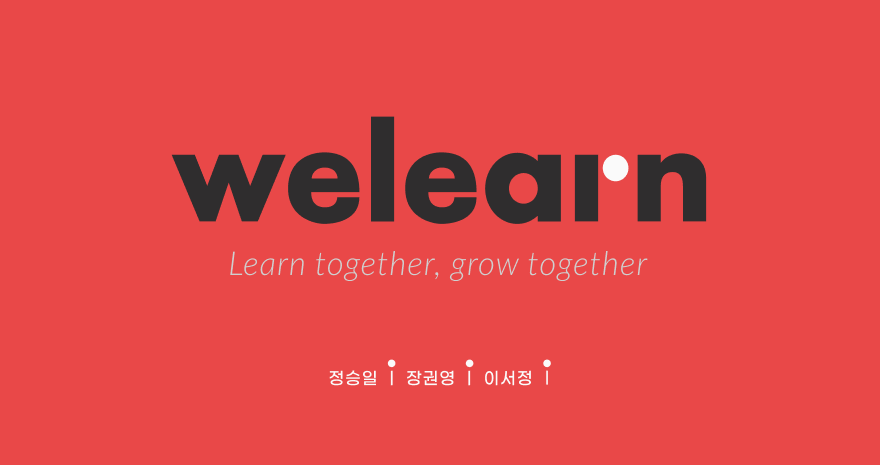
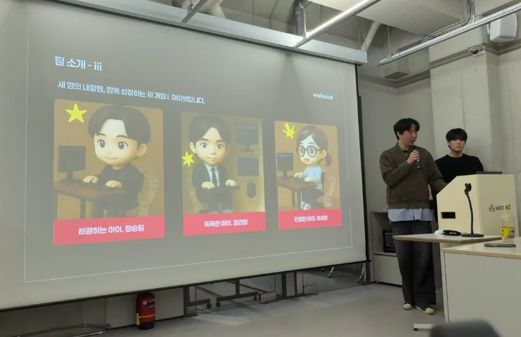

# LXP 2차 프로젝트 - 더 짧아진 프로젝트 여정 😇



## 프로젝트에 들어가며

“1차 프로젝트에서 익힌 협업 방식을 2차에서도 그대로 이어갈 수 있을까?”

1차 프로젝트를 진행하며 **체계적인 협업 프로세스**가 얼마나 큰 힘을 발휘하는지 체감했으므로 MVP 정의, 명확한 커뮤니케이션 방식, Git Flow 전략, 커밋 컨벤션과 PR 규칙 등 프로젝트가 안정적으로 실행되기까지 필요한 요소들이 무엇인지 분명히 깨닫게 된 경험이었다.

그래서 팀원이 새롭게 구성된 2차 프로젝트에서는 이 경험을 더욱 발전시켜보고자 했다.

이번 프로젝트는 **React, Redux, Firebase**를 사용해 새로운 기술 스택에 도전했다. Vanilla JavaScript를 벗어나 본격적인 프레임워크 기반 개발과 백엔드 서비스 연동을 경험하는 과정은 설렘과 긴장이 동시에 존재했다.

하지만 1차 프로젝트 덕분에 어떻게 프로젝트를 기획하고 시작해야 하는지 확실히 알 수 있었으므로 초기 세팅과 구조 잡기는 비교적 수월하게 진행할 수 있었다.

프로젝트의 핵심 목표는 **학생이 강의를 검색하고 수강을 신청하는 것**이었다. 해당 목표를 우선 순위로 두고 1차 프로젝트에 진행했던 강의 등록/수정/삭제 기능은 후순위로 두어 일정을 배분하여 진행하기로 하였다.

### 기술 스택

- **Frontend**: React, Redux Toolkit, React Router DOM, Tailwind CSS
- **Backend/DB**: Firebase (Authentication, Firestore)
- **UI/UX**: Lucide Icons, React Toastify
- **Version Control**: Git Flow
- **Collaboration**: Notion, Slack, GitHub Issues

### 개발 기간

**2025.11.04 ~ 2025.11.14 (9일)**

- 병행 개발: 11/4 ~ 11/7 (4일) - 수업과 병행
- 집중 개발: 11/8 ~ 11/12 (5일) - 전일 개발
- 발표: 11/14

---

## 프로젝트 준비 과정

### 1단계 : 도메인 요건 정의 및 MVP 정의 (11/4 ~ 11/5)

1차 프로젝트의 경험을 바탕으로 **가장 먼저 도메인 요건 정의서를 작성**했다.
"무엇을 만들 것인가"를 명확히 하는 것이 첫 번째 단계라는 것을 1차에서 배웠기 때문이다.

**서비스 핵심 역할 정의**

- 학생(USER): 강의 검색, 수강 신청, 내 강의 목록 조회
- 강사(INSTRUCTOR): 강의 등록/수정/삭제, 수강생 관리
- 관리자(ADMIN): 강사 계정 생성 (확장 예정)

**MVP 기능**

- 인증 & 권한 (회원가입/로그인/로그아웃, 역할 기반 라우팅)
- 강의 목록 (카드형 UI, 필터링, 페이지네이션, 정렬)
- 강의 상세 & 수강신청 (중복 방지, 실시간 인원 반영
- 학생 마이페이지 (수강 중인 강의 목록)
- 강사 마이페이지 (등록한 강의 목록, 조건부 수정/삭제)
- 공통 UI (Header, Button, Input, Footer, 반응형)

> 💡 배운 점: 도메인 요건 정의서를 먼저 확정하니 **MVP 핵심 기능을 명확히 정의**할 수 있었고 이를 기반으로 기능 우선순위를 설정하고 마일스톤을 체계적으로 계획할 수 있었다. 1차 때 배운 프로세스를 **2차에서 리드하며 적용**할 수 있었다는 점이 가장 큰 성장이었다.

### 2단계 : 데이터 구조 설계

Firebase Firestore의 NoSQL 특성을 고려한 데이터 구조 설계가 필요했다. 1차 프로젝트에서 localStorage를 사용했을 때와는 다른 접근이 필요했다.

**데이터 모델**

```jsx
// Users Collection
{
  userId: "uid",
  userName: "김코딩",
  email: "student@example.com",
  role: "USER", // INSTRUCTOR, ADMIN
  userCreatedAt: "2025-11-10T00:00:00Z"
}

// Lectures Collection
{
  lectureId: "uid",
  title: "React 완전정복",
  description: "실무에서 바로 쓰는 React",
  content: "상세 설명...",
  thumbnailUrl: "https://...",
  userId: "instructor_uid",
  userName: "김강사",
  category: 1,
  level: "초급",
  studentCount: 10,
  lectureCreatedAt: "2025-11-10T00:00:00Z",
  curriculum: [...]
}

// Enrollments Collection
{
  userId: "student_uid",
  lectureId: "lecture_uid",
  enrolledAt: "2025-11-20T00:00:00Z",
  status: "active",
  reviews: { rating: 5, mention: "좋아요!" }
}

```

> 💡 배운 점: 초기 데이터 구조 설계의 중요성을 확실하게 체감했다. 특히 Firebase의 NoSQL 특성상 **문서 ID(uid)를 일관되게 사용하는 것**이 데이터 정합성을 유지하는 핵심이라는 점을 늦게서야 깨달았다. 초반에는 임의의 ID를 사용해 더미데이터를 생성했는데, 이후 특정 데이터를 조회하거나 연결하는 과정에서 예상치 못한 문제가 발생했다.
> 우리 모두가 Firebase를 처음 적용해보는 상황이라 **Firebase의 구조와 특성을 고려한 데이터 모델을 설계하는 과정 자체가 쉽지 않았다.** 개발을 진행하면서 일부 데이터 모델을 계속 미세하게 조정해야 했고 그 과정에서 “아, 처음부터 더 명확하게 설계했어야 했구나”라는 생각을 깊이 하게 되었다. 이번 경험 덕분에 NoSQL 기반 서비스에서는 기초 단계에서의 설계가 얼마나 중요한지 한 단계 더 이해하게 되었다.

### 3단계 : 화면 설계서 작성

도메인 요건 정의서를 기반으로 화면 설계서를 작성했다. 각 페이지의 레이아웃, 입력 필드, 버튼 동작, 조건부 렌더링 등을 구체적으로 정의했다.

**주요 화면**

- 회원가입/로그인
- 강의 목록 (카드, 필터, 페이지네이션)
- 강의 상세 (수강신청 버튼, 조건부 렌더링)
- 학생 마이페이지 (Empty State)
- 강사 마이페이지 (조건부 수정/삭제)
- 강의 등록/수정 (폼, 파일 업로드)

**디렉터리 구조**

```bash
src/
 ├─ pages/        → 라우팅 단위 페이지 컴포넌트
 ├─ components/   → 공용 UI 컴포넌트 (ui, layout 포함)
 ├─ common/       → 전역에서 자주 쓰이는 모듈/컴포넌트
 ├─ hooks/        → 커스텀 훅
 ├─ services/     → API 호출 및 비즈니스 로직
 ├─ utils/        → 재사용 가능한 유틸·헬퍼 함수
 ├─ constants/    → 상수 관리 (URL, API 경로, 색상 등)
 ├─ lib/          → 외부 라이브러리 설정 및 초기화
 │   └─ firebase/ → Firebase 관련 설정 및 함수
 ├─ store/        → 전역 상태 관리 (Redux 등)
 ├─ assets/       → 이미지, 폰트 등 정적 리소스
 ├─ styles/       → 전역 스타일 및 테마
 └─ main          → 앱 진입 파일
```

> 💡 배운 점: 화면 설계서를 먼저 작성해두니 개발 단계에서 “어떻게 구현할지” 고민하는 시간이 크게 줄었다. 각 기능의 흐름과 UI 구성이 이미 명확했기 때문에 팀 동료 간 커뮤니케이션도 매끄럽게 이루어졌다.
>
> 또한 디렉터리 구조를 사전에 정의해둔 덕분에 화면 설계서가 완성된 후 **HTML과 Tailwind로 제작해둔 초기 컴포넌트를 구조에 맞춰 빠르게 분리·배치**할 수 있었다. 이 과정은 작업 속도를 높이는 데 큰 도움이 되었고 프로젝트를 마친 뒤 초반 설계가 전체 개발 속도와 완성도에 얼마나 큰 영향을 미치는지 더욱 실감하게 되었다.

---

## 본격 개발

### Day 1 : 개발 환경 세팅 & 인증 시스템 (11/6)

**협업 전략 수립**

- Git Flow 전략 (main → develop → feature/#이슈번호)
- 커밋 컨벤션 (feat, fix, refactor, chore 등)
- 이슈 기반 개발 (Issue-Driven Development)
- 코드 리뷰 필수화 (최소 1명 approve 필수)
- PR 등록 시 Slack 공유

**Firebase 초기 설정**

- Authentication 설정
- Firestore Database 생성

> 💡 배운 점: 1차 프로젝트와는 다른 팀원 구성이었지만 이전 프로젝트에서 효과적이었던 협업 방식을 선별적으로 도입한 것이 큰 도움이 되었다. 특히 1차 프로젝트에서 사용했던 **커밋 컨벤션과 PR 규칙의 장점만을 현재 팀 상황에 맞게 재정의하고**, 팀 동료들과 함께 실제로 활용 가능한 부분만 골라 규칙을 세운 과정이 협업 효율을 높였다. 이러한 합의 과정 덕분에 모두가 같은 기준을 공유하게 되었고 초기 작업 속도도 안정적으로 유지할 수 있었다.

### Day 2-4 : 핵심 기능 개발 (11/7 ~ 11/9)

집중 개발 기간에 접어들며 본격적으로 기능 구현을 시작했다.

| 구분                 | 담당   | 주요 작업                               |
| -------------------- | ------ | --------------------------------------- |
| **강의 목록 페이지** | 정승일 | - 재사용 가능한 강의 카드 컴포넌트 설계 |

- 카테고리 필터링 기능
- 페이지네이션(8개씩 표시)
- 최신순/수강 인원순/별점순 정렬 |
  | **강의 상세 페이지** | 이서정 | - 조건부 수강신청 버튼
  • 비로그인 → 로그인 페이지 이동 
  • 중복 신청 방지 
  • 강사 본인 강의 → 수정 버튼 표시
- 실시간 수강 인원 업데이트 |
  | **인증 & 권한 시스템** | 장권영 | - Firebase Authentication 연동
- 역할 기반 라우팅(ProtectedRoute)
- 로그인 상태 유지 |
  | **데이터 관리** | 장권영 | - Redux Toolkit 전역 상태 관리
- Firestore CRUD 구현
- 더미데이터 생성 스크립트 제작 |

> 💡 배운 점: React와 Redux를 활용하면서 **세부적인 관심사별로 컴포넌트를 명확하게 분리할 수 있다는 점**을 실감했다. 특히 데이터 관리를 동료가 전담해 **전역 상태 관리 구조를 먼저 안정적으로 구축해준 덕분에** 각 페이지에서 필요한 로직을 독립적으로 구성할 수 있었고 작업 흐름도 훨씬 수월했다.
>
> 또한 개발 초반에는 **재사용 가능한 컴포넌트, 기능, 함수의 기준을 어떻게 잡아야 하는지 고민**이 많았지만 실제로 컴포넌트를 재사용하면서 구조적 효율성과 유지 보수의 중요성을 확실히 느낄 수 있었다. 이러한 경험을 통해 재사용성과 관심사 분리에 대한 감각이 한층 더 성장했다.

### Day 4 : 1차 QA (11/9)

**1차 QA 주요 이슈**

| 구분             | 이슈                                                 |
| ---------------- | ---------------------------------------------------- |
| 공통             | 푸터 하단 고정                                       |
| /login           | Form 박스 아래 회원가입 버튼 커서 적용               |
| /logout          | 로그아웃 시 머물던 페이지로 이동 (마이페이지 제외)   |
| /lectures        | 필터링 시 데이터 깜빡임 → 스켈레톤 UI 적용           |
| /lectures        | 페이지네이션 적용                                    |
| /lectures        | 목록 타이틀 : 카테고리 클릭 시 해당 타이틀 동적 적용 |
| /lectures/detail | 리뷰 개수 + 별점 평점 적용                           |
| /mypage          | 학생이 강사 마이페이지 접근 시 403 오류 페이지       |

> 💡 배운 점: 1차 프로젝트에서 적용했던 **QA 1차·2차 분할 진행 방식**을 이번 프로젝트에도 도입한 것이 도움이 되었다. 이슈를 한 번에 몰아서 해결하려 하기보다 단계적으로 분리해 처리하니, 제한된 기간을 효율적으로 활용할 수 있었다. 우선순위를 명확하게 조정할 수 있었고 큰 버그 없이 자잘한 이슈 중심으로 빠르게 해결할 수 있어 전체적인 개발 흐름 역시 안정적으로 유지되었다.

### Day 5-7 : 추가 기능 & 2차 QA (11/10 ~ 11/12)

| 구분                | 담당   | 주요 기능                  |
| ------------------- | ------ | -------------------------- |
| **학생 마이페이지** | 장권영 | - 수강 중인 강의 목록 표시 |

- Empty State 처리 (수강 강의 없음)
- 학습하기 클릭 → 상세 페이지 이동 |
  | **강사 마이페이지** | 이서정 | - 등록한 강의 목록 표시
- 조건부 수정/삭제 버튼 제공 
  • 수강생 존재 시 삭제 불가 + 안내 메시지 
  • 수정 시 일부 필드 disabled |
  | **강의 등록 페이지** | 정승일 | - 입력 폼 구성 (제목, 설명, 카테고리, 난이도, 썸네일)
- 썸네일 업로드
- 등록 완료 후 강사 마이페이지로 리다이렉트
- 컬리큘럼 등록/삭제 (챕터,세션 1개인 경우 삭제 불가) |
  | **강의 수정 페이지** | 장권영 | - 기존 강의 데이터 불러오기
- 수강생 존재 시 일부 필드 수정 제한
- 커리큘럼 항목 수정 및 추가 기능 |

> 💡 배운 점:
>
> 핵심 기능을 계획한 일정에 맞춰 무리 없이 구현할 수 있었기 때문에 1차 QA에서 발견된 개선점도 빠르게 보완할 수 있었다. 그 덕분에 팀원 모두가 추가 기능을 자연스럽게 분담하며 속도감 있게 개발을 이어갈 수 있었다. 이 과정에서 동료가 **UI/UX 완성도를 높일 수 있는 Toastify 라이브러리 사용을 제안**했고, **전반적인 알림 기능을 Toastify 기반으로 리팩토링하는 작업**도 수월하게 진행되었다.
>
> 도메인별로 기능을 나누어 개발하다 보니 구현 순서가 어긋나는 시점도 있었다. 강의 등록 기능이 준비되지 않은 상태에서 강사 마이페이지의 삭제 기능을 먼저 작업하게 되었고 삭제 로직이 예상대로 작동하지 않아 반나절 동안 해결에 매달리는 상황이 발생했다.
>
> 해당 문제를 공유하고 **팀 동료 모두가 적극적으로 해결책을 고민**해 주었고, 결국 원인을 파악해 개선할 수 있었다. 이 과정에서 1차 더미데이터의 문제점을 발견해 데이터 구조를 다시 점검하는 시간을 가졌으며 결과적으로 기능 완성도를 높이는 계기가 되었다.
>
> 무엇보다 이 경험은 **‘원팀’이라는 감정을 깊이 느낄 수 있었던 순간**이었다.

### Day 8 : 전체 시나리오 테스트 및 발표 준비 (11/13)

**전체 시나리오 테스트**

발표를 하루 앞두고 프로젝트 전체 시나리오 테스트를 진행했다. 테스트 과정에서 전날 발생했던 Firebase 할당량 초과로 인한 _“Quota exceeded”_ 오류의 원인을 끝까지 파악하고 해결해내는 동료를 보며 그 모습이 참 인상 깊었다. “아, 이런 모습이 개발자의 모습이구나”라는 생각이 들 정도로 자랑스러웠다.

또한 시간적 여유가 많지 않은 상황에서도 우선순위에서 잠시 밀려 있었던 강의 수정 페이지를 끝까지 책임지고 완성해내는 다른 동료의 모습을 보며 큰 감동을 받았다. 자연스럽게 “나도 저렇게 멋있는 개발자가 되어야지”라는 다짐이 생겼다.

**발표 자료 구성**

전체 테스트가 마무리된 후 발표를 위한 자료를 준비했다. 이번 프로젝트에서는 PPT 대신 Figma로 슬라이드를 제작하며 동료들과 피드백을 주고받고 디자인과 흐름을 조율해 나갔다. 함께 수정하고 보완하는 과정에서 발표 자료의 완성도도 높아졌다.


> 💡 배운 점: 이번 발표 자료를 만들면서 기존에 사용하던 Figma가 아니라 최근 업데이트된 **Figma Slides**를 직접 경험할 수 있었다. 익숙했던 도구에 새로운 기능이 더해지는 과정을 보며 디자인 툴 역시 끊임없이 발전하고 있고 그만큼 새로운 기술을 빠르게 습득하는 태도가 중요함을 다시 느끼게 되었다.

### Day 9 : 발표 (11/14)

우리 팀은 **가장 마지막 순서**로 발표를 맡게 되었다. 다른 팀들의 발표를 보며 배울 점을 찾고, 우리만의 강점을 어떻게 부각시킬지 고민할 수 있는 시간이었다.



이번 발표를 통해 단순히 기능 구현만 잘한다고 끝이 아니라 **발표의 완성도 역시 프로젝트의 중요한 일부**라는 점을 경험했다. 라이브 시연 중 예기치 못한 오류가 그대로 노출되며 발표 흐름이 흔들렸고, 이를 계기로 **안정적인 시연을 위해 사전 검증과 리허설이 얼마나 중요한지** 그리고 **필요하다면 시연 영상을 준비하는 선택도 고려해야 한다는 점**을 배우게 됐다.

또한 강사님이 강조하신 것처럼 잘 준비된 시연은 결과물을 가장 확실하게 보여주는 방법이라는 점을 깨달으며 다음 발표에서는 **상황에 흔들리지 않는 발표 구성과 시연 안정성**을 더 신경 쓰고자 다짐하게 되었다.

---

## 트러블슈팅

### Issue 1: 데이터 정합성 이슈 → 1차 더미데이터 테스트 실패

| **문제**                                                                   | **원인**                                                                                                                           | **해결 방법 및 개선**                                                                                                                                              |
| -------------------------------------------------------------------------- | ---------------------------------------------------------------------------------------------------------------------------------- | ------------------------------------------------------------------------------------------------------------------------------------------------------------------ |
| Enrollment 테이블에서 수강생 한 명이 같은 강의를 두 번 수강하는 현상 발생. | Lecture 테이블에서 고유한 uid를 부여하지 않고 임의의 값(ex. user001)을 부여했기 때문. Firebase의 NoSQL 구조에 대한 이해도가 낮았음 | **데이터 구조 재설계**: lectureId를 Firebase uid와 동일하게 사용하도록 변경. **더미데이터 생성 스크립트 개발**: Node.js 기반으로 Authentication + Firestore 동기화 |
|                                                                            |

**더미데이터 생성 스크립트**

Firebase 기반 강의 플랫폼을 개발하면서 테스트 데이터가 부족해 기능 검증과 UI 흐름을 확인하는 데 어려움이 있었다. 이를 해결하기 위해 권영님이 **Node.js 기반 시드(seed) 스크립트**를 작성해주었다.

```bash
// 실행방법
npm run dummy
```

이 스크립트 덕분에 대규모 데이터 상황 시뮬레이션 가능, 일관된 테스트 환경 제공, 개발 효율 극대화를 경험할 수 있었다.

> 💡 배운 점: 더미데이터 생성 스크립트를 적용하는 과정을 보며 새로운 해결 방식에 대한 시야가 넓어졌다. 이를 통해 **Firebase의 NoSQL 구조에서는 UID 전략과 초기 데이터 모델링이 핵심**이라는 점을 이해하게 되었고 안정적인 테스트 환경의 중요성도 함께 배울 수 있었다.

### Issue 2: Firebase 할당량 초과

| 문제                                                                                | 원인                                                                                                                 | 해결 방법 및 개선                                                                                                                                                                                                 |
| ----------------------------------------------------------------------------------- | -------------------------------------------------------------------------------------------------------------------- | ----------------------------------------------------------------------------------------------------------------------------------------------------------------------------------------------------------------- |
| Firestore 사용 중 "Quota exceeded" 오류가 발생하여 정상적인 데이터 조회·업로드 불가 | 많은 테스트 데이터 업로드로 인해 할당량 급격히 소진됨.<br>Firestore 접속 시 컬렉션 조회가 1차로 이루어져 조회수 증가 | **쿼리 최적화**: 필요한 필드만 제한적으로 조회하도록 수정 및 개발 단계에서 불필요한 호출 제거<br>**임시 컬렉션 활용**: 임시 `_Empty` 컬렉션을 생성, 해당 컬렉션에서 먼저 수행 후 실제 데이터 컬렉션 조회를 최소화 |

> 💡 배운 점: 실제 서비스 운영 시 비용 관리와 쿼리 최적화의 중요함을 알 수 있었다.

## 협업에서 배운 것들

### 1차와 2차 기술 스택의 변화

| 구분      | 1차 프로젝트                  | 2차 프로젝트                       |
| --------- | ----------------------------- | ---------------------------------- |
| Frontend  | Vanilla JavaScript, HTML, CSS | React, Redux Toolkit, Tailwind CSS |
| Storage   | localStorage API              | Firebase (Firestore)               |
| 상태 관리 | 없음                          | Redux Toolkit                      |
| 라우팅    | 없음                          | React Router DOM                   |

|

### 협업 방식의 변화

| 구분        | 1차 프로젝트                          | 2차 프로젝트                                                             |
| ----------- | ------------------------------------- | ------------------------------------------------------------------------ |
| 준비 과정   | MVP 정의, 데이터 구조 설계, 화면 설계 | 도메인 요건 정의서 먼저 작성 → 데이터 구조 설계 → MVP 정의 → 화면 설계서 |
| 개발 방식   | 기능별 개발                           | 역할 기반 도메인 개발 (학생/강사 기능 분리)                              |
| 데이터 관리 | localStorage (동기)                   | Firebase Firestore (비동기)                                              |
| QA          | 2회                                   | 2회                                                                      |

---

## 끝으로

2차 프로젝트는 1차에서 배운 협업 방식을 **적용하고 리드한 경험**이었다. React와 Firebase로 확장하면서 개발 흐름을 체득했고 NoSQL 기반 데이터 구조 문제 해결과 Firebase 오류 대응 등을 통해 **실전 문제 해결 능력**을 경험할 수 있었다. 그리고 더미데이터 스크립트 적용, 역할 분담, PR 기반 협업 등 체계적인 프로세스를 운영하면서 팀워크의 힘을 느낄 수 있었다.

1차가 “함께라면 더 잘할 수 있다”는 배움이었다면 2차는 “체계적인 준비가 더 멀리 가게 한다”는 확신을 준 프로젝트였다.

---

## 프로젝트 링크

- **GitHub Repository**: https://github.com/20250915-POTENUP-FE-1/LXP_WeLearn
- **프로젝트 문서**: [3팀 : iii(3i)](https://www.notion.so/3-iii-3i-2a0649136c1180bda581c2995c55849a?pvs=21)
- **기술 스택**: React, Redux Toolkit, Firebase, Tailwind CSS, Lucide Icons, React Toastify
