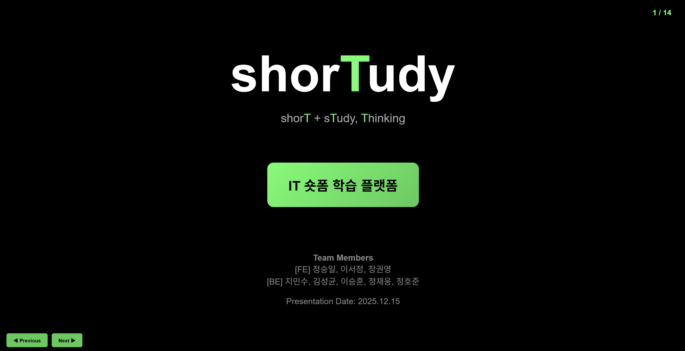

# LXP 3차 프로젝트 회고 — LXP란 무엇인가?

<br>



<br>

## 들어가며

1차와 2차 프로젝트에서 우리가 이해한 LXP(Learning Experience Platform)는 비교적 명확했다.  
학습자의 경험을 중심으로 학습 여정을 설계하고, 콘텐츠와 인터랙션을 통해 성장을 돕는 플랫폼이었다.

3차 프로젝트에서는 기존 React/Redux 기반 코드베이스를 Next.js와 TypeScript로 마이그레이션하며, <br>
콘텐츠 관리와 서버 통신까지 고려해야 하는 기술적 미션도 함께 주어졌다.

하지만 이 프로젝트의 전환점은 기술이 아니었다.  
백엔드 팀과의 본격적인 협업이 시작되며, 3명의 프론트엔드와 5명의 백엔드로 구성된 8명의 팀원 사이에서 전혀 다른 질문이 던져졌다.

<b>“우리는 정말 LXP를 만들고 있는가?”</b>

가장 큰 도전은 기술이 아니라 개념이었다.  
프론트엔드와 백엔드, 서로 다른 관점을 가진 팀원들이  
LXP의 본질을 어디에 둘 것인지 다시 정의해야 했다.

<b>서로 다른 배경과 관점을 가진 사람들이 하나의 비전을 만들어가는 과정.  
이것이 우리가 3차 프로젝트에서 마주한 진짜 과제였다.</b>

이 글은 <u>LXP를 어떻게 재정의했는지</u>,  
그리고 <b>왜 그런 선택을 했는지에 대한 회고</b>다.

\*본 문서에서 Shorts는 lesson(학습 단위)을 의미한다.

<br><br>

### 기술 스택

- **Frontend** : Next.js(App Router), TypeScript, Tailwind CSS, shadcn, Framer Motion
- **Backend/DB** : Java 17, Spring Boot, Spring Security, Spring Data JPA, JWT, Swagger(OpenAPI), MySQL
- **UI/UX** : Lucide Icons, React Toastify
- **Version Control** : Git Flow
- **Collaboration** : Notion, Slack, GitHub Issues

<br>

### 개발 기간 : **2025.12.01 ~ 2025.12.15 (15일)**

- **병행 개발** : 12/01 ~ 12/05 (수업과 병행)
- **집중 개발** : 12/06 ~ 12/09 (전일 개발)
- **API 연동 및 통합 시작** : 12/09
- **테스트** : 12/10 ~ 12/12
- **발표** : 12/15

<br><br>

## 프로젝트 재정의 : 우리가 만드는 것은 무엇인가?

### 1. LXP 개념 정립의 필요성

3차 프로젝트 초기 기획 회의에서 예상하지 못한 사실을 마주했다. 8명의 팀원이 모두 LXP를 다르게 이해하고 있었다.

누군가는 학습 로드맵 중심의 플랫폼을, 누군가는 실무 지식을 빠르게 찾는 도구를, 또 누군가는 콘텐츠 관리 시스템에 가까운 형태를 떠올리고 있었다.

이 상태로는 기술 선택도, 기능 우선순위도 정할 수 없었으므로 각 팀(프론트엔드/백엔드)이 내부 합의를 먼저 정리한 뒤 서로의 관점을 공유하고 공통 목표와 최소 MVP를 다시 정의하기로 했다.

<br>

### 2. 백엔드 팀과의 비전 조율

- <b>핵심 철학</b> <br>
  논의를 거쳐 우리가 합의한 LXP의 핵심 철학은 두 가지였다. <b>학습은 ‘시간을 내서 하는 일’이 아니라, 막히는 순간 바로 이어지는 경험이어야 한다.</b>는 데 의견이 모였다.

  - 지식은 가능한 최소 단위로 쪼갠다
  - 궁금한 순간 즉시 해결할 수 있어야 한다.

- <b>관점의 차이</b> <br>
  실제 서비스 형태로 풀어내는 과정에서 가장 큰 논쟁 지점은 "우리는 롱폼 학습을 제공해야 하는가?" 였다.

  <br>

  <b>왜 롱폼이 아닌 숏폼인가?</b>
  | 구분 | 프론트엔드 관점 | 백엔드 관점 |
  | -------- | ----------------- | --------------------- |
  | 숏폼 학습 깊이 | 얕고 휘발적인 지식 | 깊이보다 진입 장벽을 낮추는 것이 중요 |
  | 롱폼 인식 | 깊은 학습에 대한 대안 필요 | 탐색 비용이 높고 완주율이 낮음 |
  | LXP 핵심 | 학습 여정과 성장 로드맵 | 실무에서 바로 쓰이는 지식 |
  | 커리큘럼 | 체계가 없으면 성장 감각이 약함 | 완성형보다 즉시 활용 |
  | 사용자 행동 | 흐름을 따라 학습 | 필요할 때만 단발성 사용 |
  | 서비스 역할 | 설계된 학습 경험 | 학습 시작의 진입점 |

<br><br>

- <b>최종 합의</b> : 경쟁이 아닌 연결

  논의 끝에 우리는 LXP의 역할을 다시 정의했다.

  - shorTudy는 기존 학습 플랫폼의 경쟁자가 아니다.
  - 깊은 학습으로 들어가기 전의 관문(Gateway) 이다.
  - 숏폼으로 가볍게 진입한 뒤, 외부 롱폼 콘텐츠로 자연스럽게 연결된다.
  - 롱폼을 직접 제공하지 않음으로써 콘텐츠 관리 복잡도를 줄이고 본질에 집중한다.

  이 합의를 통해 shorTudy는 ‘모든 것을 제공하는 학습 플랫폼’이 아니라 “The Shortest Path to Growth” 라는 명확한 정체성을 갖게 되었다.

  <br>

### 3. Shorts 기능 도입 배경과 의사결정 과정

- <b>Shorts 기능 도입 배경</b>

  Shorts는 단순한 숏폼 콘텐츠가 아닌 지금 당장 필요한 질문에 빠르게 답하는 학습 단위를 목표로 설계되었다.

  - Swipe/Drag 기반 인터랙션으로 학습 흐름 유지
  - 모바일 중심 UX를 고려한 설계
  - 시청 이후 추가 학습으로 이어지는 전환 구조

- <b>의사결정 과정</b>

  Shorts 기능은 '완주 부담이 없을 것, 진입이 빠를 것, 확장이 가능할 것' 기준으로 설계했으며 단순 목록이 아닌 전용 플레이어 형태로 구현하기로 결정했다.
  Shorts 기능은 학습을 ‘결심해야 하는 일’이 아니라 필요한 순간에 바로 시작하는 행동으로 바꾸기 위한 선택이었다.

  따라서 이번 프로젝트의 MVP는 숏폼 플레이어를 중심으로, 외부 롱폼 학습으로 자연스럽게 이어지는 ‘학습 진입 경험’에 집중하는 것으로 정의했다.

<br><br>

## 역할 분담 및 구현 기능

이번 프로젝트에서는 기능 단위가 아닌 **주요 도메인을 먼저 정의한 뒤**,  
각 도메인별로 담당자를 지정해 설계부터 구현까지 책임지는 방식으로 진행했다.

<br>

| 구분         | 담당자          | 주요 도메인 / 기능                 | 구현 내용                                                                                                                                                                        |
| ------------ | --------------- | ---------------------------------- | -------------------------------------------------------------------------------------------------------------------------------------------------------------------------------- |
| **Frontend** | **[FE] 이서정** | 숏폼 전용 페이지 (Shorts / lesson) | - 숏폼 전용 플레이어 UI 구현<br>- Swipe / Drag 기반 콘텐츠 전환<br>- 키보드·버튼 네비게이션 지원<br>- 모바일/데스크톱 반응형 레이아웃 설계<br>- Framer Motion 기반 인터랙션 구현 |
| **Frontend** | [FE] 장권영     | 홈(Main)                           | - 카테고리별 필터링 UI<br>- 숏폼 목록 및 썸네일 배치<br>- 태그 기반 숏폼 리스트 구성<br>- 메인 화면 정보 구조 설계                                                               |
| **Frontend** | [FE] 정승일     | 회원가입 / 로그인                  | - 이메일 기반 회원가입·로그인 UI<br>- 입력값 검증(이메일 형식, 비밀번호 길이)<br>- 인증 흐름에 따른 화면 제어                                                                    |
| **Backend**  | [BE] 팀(5명)    | 인증 / 유저 도메인                 | - 회원가입·로그인 API 구현<br>- JWT 기반 인증/인가 처리<br>- USER / ADMIN 역할 분리                                                                                              |
| **Backend**  | [BE] 팀(5명)    | 숏폼(lesson) 도메인                | - 숏폼 리스트 조회 API<br>- 페이지네이션 기반 데이터 제공<br>- Swagger(OpenAPI) 문서화                                                                                           |
|              |

<br><br>

## 기술적 도전과 해결

### 1. 마이그레이션

기존 React 기반 프로젝트를 Next.js(App Router) 구조로 전환하면서
단순한 프레임워크 교체가 아닌 아키텍처 재설계가 필요했다.

- <b>React -> Next.js 전환 이슈</b>

  기존 CSR 중심 구조에서 서버 컴포넌트와 클라이언트 컴포넌트의 역할을 다시 정의해야 했다.
  특히 상태 관리와 브라우저 의존 로직을 어디에 둘지에 대한 기준을 세우는 과정이 필요했다.

- <b>App Router 구조 설계</b>

  라우트 단위로 책임을 명확히 나누고 레이아웃과 페이지를 분리해 확장 가능한 구조를 설계했다. 공통 UI는 layout으로 인터랙션 중심 컴포넌트는 client 영역으로 분리했다.

- <b>TypeScript 타입 안정성 확보</b>

  마이그레이션 과정에서 타입 정의가 불명확한 부분이 가장 큰 오류 원인이었다.
  API 응답 타입을 명확히 정의하고 컴포넌트 간 props 흐름을 타입으로 고정해 런타임 오류를 줄였다.

<br>


<br><br>

### 2. Shorts 플레이어 구현

Shorts는 프로젝트의 핵심 기능인 만큼 사용성·반응성·성능을 동시에 고려해야 했다.

- <b>Framer Motion 기반의 Swipe/Drag 인터랙션</b>

  CSS 기반 드래그 로직은 관성과 탄성이 부족했고 터치/마우스 이벤트 처리도 복잡했다.
  Framer Motion의 drag API와 spring 애니메이션을 활용해 물리 기반의 자연스러운 제스처를 구현했다.

  <br>

  ```tsx
  <motion.div
    drag="y"
    dragConstraints={{ top: 0, bottom: 0 }}
    dragElastic={0.2}
    onDragEnd={(event, info) => {
      if (info.offset.y > 50) handlePrevious();
      else if (info.offset.y < -50) handleNext();
    }}
    animate={{ y: currentIndex * -window.innerHeight }}
    transition={{ type: 'spring', stiffness: 300, damping: 30 }}
  />
  ```

  Framer Motion의 선언적 방식 덕분에 모바일과 데스크톱에서 일관된 경험을 제공할 수 있었다.

- <b>반응형 디자인(모바일/데스크톱)</b>

  모바일에서는 세로 몰입형 경험을 데스크톱에서는 탐색과 시청이 균형 잡힌 UI를 목표로 레이아웃을 분기했다. 데스크톱 환경에서는 터치 제스처가 제한적이라는 점을 고려해 명시적인 스와이프 버튼을 제공하고, 키보드 입력을 통한 화면 전환도 가능하도록 설계했다.

- <b>API 호출 최적화: 개별 호출에서 리스트 기반으로</b>

  초기에는 사용자가 스와이프할 때마다 다음 Shorts를 개별적으로 API 호출하는 구조였다. 빠르게 넘길 때 여러 요청이 동시에 발생해 성능이 저하될 수 있다는 점을 프론트엔드 팀원들과 상의 후 수정했다.

  ```tsx
  // Before: 개별 API 호출
  const loadNextShort = async (currentId: number) => {
    const response = await fetch(`/api/shorts/${currentId + 1}`);
    // 매 스와이프마다 네트워크 요청 발생
  };

  // After: 리스트 기반 호출
  const loadShortsList = async (page: number = 0, size: number = 10) => {
    const response = await fetch(`/api/shorts?page=${page}&size=${size}`);
    setShortsList(data.content); // 10개를 한 번에 로드
  };
  ```

  한 번의 API 호출로 여러 개의 Shorts를 가져온 후, 로컬 상태에서 인덱스만 변경하는 방식으로 전환했다.

<br>

### 3. API 통합의 현실

개발 초기에는 Mock API를 기반으로 UI를 빠르게 검증했지만 실제 백엔드 API와 통합하면서 여러 현실적인 문제를 마주했다.

- <b>Mock API 에서 실제 백엔드로의 전환</b>

  프론트엔드는 API 명세를 기준으로 구현을 진행했으나 Swagger에서 확인한 실제 Response 구조가 명세서와 다른 부분이 존재했다. 그리고 변경된 응답 구조에 대한 명세서 업데이트가 이루어지지 않아 결과적으로 서로 다른 3가지 형태의 응답 구조를 동시에 마주하게 되었다. 중첩된 객체 구조를 프론트엔드에서 흡수해야 하는지, API 구조 자체를 다시 정리해야 하는지에 대한 판단이 필요했고 컴포넌트와 타입을 어떤 기준으로 수정해야 할지 혼란이 발생했다.

이 경험을 통해 API 통합에서 명세의 일관성과 변경 공유가 얼마나 중요한지를 체감할 수 있었고, 단순히 “연결한다”를 넘어 프론트엔드와 백엔드가 같은 구조를 바라보고 있는지 확인하는 과정이 개발의 중요한 일부라는 점을 배웠다.

<br><br>

## 협업의 기술

이번 프로젝트에서 협업은 단순한 역할 분담이 아니라 각 직군이 바라보는 문제를 어떻게 하나의 방향으로 정렬할 것인가의 과정이었다.

- <b>백엔드와의 API 스펙 조율 과정</b>

  API의 실제 응답 구조를 기준으로 명세를 재정비하고 변경 사항을 공유하는 기준을 다시 합의했으며 프론트엔드에서는 타입 정의를 명확히 분리해 구조 변경에 대응할 수 있도록 개선했다.

  <br>

- <b>컴포넌트 아키텍처 설계 원칙</b>

  프론트엔드에서는 기능 확장과 유지보수를 고려해 컴포넌트의 책임을 명확히 나누는 것을 원칙으로 삼았다.

  - UI 컴포넌트와 비즈니스 로직 분리
  - 재사용 가능한 컴포넌트와 페이지 전용 컴포넌트 구분
  - 상태를 가지는 컴포넌트의 범위를 최소화

<br><br>

## 회고와 배움

- <b>기술적 성장 : Next.js 서버/클라이언트 컴포넌트 이해, 타입 안정성의 가치</b>

  Next.js(App Router)를 사용하며 서버 컴포넌트와 클라이언트 컴포넌트의 역할을 명확히 이해하게 되었고 TypeScript를 통해 타입 안정성이 개발 생산성과 직결된다는 점을 체감했다.
  “동작하는 코드”보다 “안전하게 변경 가능한 코드”의 중요성을 배운 프로젝트였다.

- <b>협업적 성장 : 다른 직군과의 협업 노하우, 명확한 커뮤니케이션의 중요성</b>

  프론트엔드와 백엔드, 서로 다른 관점을 가진 팀원들과 협업하며 문제의 원인을 기술이 아닌 맥락과 의사결정 과정에서 설명하는 법을 배우게 되었다. 명확한 커뮤니케이션이 곧 개발 속도와 품질로 이어진다는 점을 경험했다.

- <b>아쉬운 점과 개선 방향 : 낮은 MVP 설정, 향후 개선하고 싶은 기능들</b>

  MVP 범위를 다소 보수적으로 설정해 Shorts 이후의 학습 흐름을 충분히 확장하지 못한 점은 아쉬움으로 남는다. 이후에는 콘텐츠 등록, 수정, 삭제 및 좋아요, 댓글, 공유 등 추천 기능과 학습 흐름을 시각화하는 기능을 추가해 LXP로서의 정체성을 더욱 강화해보고 싶다.

<br><br>

## 프로젝트 링크

- **GitHub Repository** : https://github.com/35FUND/LXP_WeLearn
- **프로젝트 문서**
  - [3팀 : iii(3i)](https://www.notion.so/3-iii-3i-2a0649136c1180bda581c2995c55849a?pvs=21)
  - [5팀 : 35FUND](https://www.notion.so/ohgiraffers/35FunDevleop-2bc649136c1180f79a51cdfe1cf39c60)
- **기술 스택** : Next.js(App Router), TypeScript, Tailwind CSS, shadcn, Framer Motion, Lucide Icons, React Toastify
