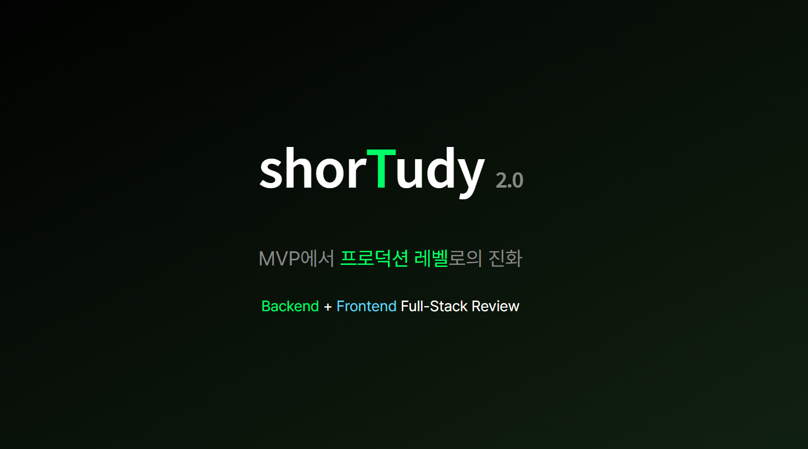

# LXP 4차 프로젝트 회고 — 기능 확장과 기술적 도전

<br>



<br>

## 들어가며

지난 3차 프로젝트에서는 LXP의 정체성을 재정의하고 숏폼 플레이어 중심의 MVP를 완성했다. 이번 4차 프로젝트는 그 기반 위에 실제 사용자 경험을 완성하기 위한 기능 확장 단계로 기술적 도전에 중점을 두었다.

숏츠 등록/수정/삭제, 내가 만든 숏츠 목록, 댓글과 대댓글, 좋아요, 플레이리스트 등 **사용자가 콘텐츠를 직접 생성하고 관리할 수 있는 기능**을 구현하는 것이 핵심 목표였다.

지난 프로젝트의 MVP 범위가 비교적 제한적이었떤 점을 고려해 이번에는 새로운 페이지에 대한 화면설계서 작성부터 시작해 총 8개의 신규 페이지를 MVP로 정의하고 개발을 진행했다.

이 과정에서 내가 마주한 가장 큰 기술적 도전은 **파일 업로드**였다.
Server Action의 1MB Body 제한이라는 이슈에 부딪히며, S3 Presigned URL이라는 새로운 아키텍처를 학습하고 적용해야 했다.

**기술적 한계를 단순히 우회하는 것이 아니라 그 제약을 이해하고 더 나은 방식으로 해결하는 경험.** 이것이 이번 4차 프로젝트에서 내가 얻은 성장이다.

<br><br>

### 기술 스택

- **Frontend**: Next.js 16 (App Router), React 19, TypeScript, Tailwind CSS 4
- **Animation**: Framer Motion
- **UI Components**: Radix UI (Dropdown Menu), Lucide Icons, React Toastify
- **State Management**: React Hook Form, Server Actions
- **File Upload**: AWS S3 Presigned URL
- **Version Control**: Git Flow
- **Collaboration**: Notion, Slack, GitHub Issues

<br>

### 개발 기간: **2024.12.19 ~ 2025.01.20 (약 4주)**

- 📅 12/17: 4차 MVP 정의 회의 (FE/BE)
- 📅 12/23: 화면 설계서 (FE/BE UI 확정)
- 📅 12/29-01/11: 병행 개발 (수업과 병행, UI 구현 및 Mock 데이터 기반 개발)
- 📅 01/12-01/19: 집중 개발 (전일, API 연동 및 통합 테스트)
- 🔗 01/14: 백엔드 API 연동 (1차)
- 🔗 01/16: 백엔드 API 연동 (2차)
- ✅ 01/16-01/18: 통합 테스트 및 버그 수정
- 🎤 01/19: 최종 발표

<br><br>

## 4차 프로젝트 목표: MVP에서 실제 서비스로

### 1) 3차 → 4차 확장 범위

3차 프로젝트에서 구현한 숏폼 플레이어와 기본 인프라 위에
사용자가 실제로 서비스를 활용할 수 있는 핵심 기능을 추가하는 것이 목표였다.

| 3차 프로젝트 (MVP)              | 4차 프로젝트 (기능 확장)               |
| ------------------------------- | -------------------------------------- |
| 숏폼 플레이어 (스와이프/드래그) | 숏츠 등록/수정/삭제 (CRUD)             |
| 메인 페이지                     | 마이페이지 (대시보드, 내 숏츠, 좋아요) |
| 회원가입/로그인                 | 댓글/대댓글/좋아요 모달                |
| 기본 UI 컴포넌트                | 플레이리스트 기능                      |

<br>

### 2) 4차 MVP 기능 정의

기능 구현 우선순위를 명확히 정의하고, 백엔드 팀과 협의하여 API 스펙을 조율했다.

<br>

**1단계: 필수 구현 (High Priority)**

| 기능                   | 담당                     | 상세                            |
| ---------------------- | ------------------------ | ------------------------------- |
| 화면 설계 및 UI 디자인 | [FE] 이서정, [FE] 정승일 | 전체 서비스 UI/UX 디자인 시스템 |
| 마이페이지             | [FE] 이서정              | 대시보드, 내가 등록한 숏츠 목록 |
| 숏츠 등록/수정/삭제    | [FE] 이서정              | CRUD 기능 전체                  |
| 숏츠 액션바            | [FE] 정승일              | 좋아요, 저장                    |
| 숏츠 액션바 (모달)     | [FE] 정승일              | 댓글,대댓글 등록/수정/삭제      |
| 숏츠 플레이리스트      | [FE] 정승일              | 숏츠 모음 기능                  |

<br>

**2단계: 차순위 기능 (Low Priority)**

- 카테고리별 필터, 정렬, 검색
- 프로필 등록/수정/탈퇴
- 좋아요한 숏츠 목록 삭제/공유
- 저장한 숏츠 목록 삭제/공유
- 숏츠 액션바 공유 모달

<br><br>

## 역할 분담 및 구현 기능

| 구분         | 담당자          | 주요 도메인 / 기능     | 구현 내용                                                                                                                                                              |
| ------------ | --------------- | ---------------------- | ---------------------------------------------------------------------------------------------------------------------------------------------------------------------- |
| **Frontend** | **[FE] 이서정** | 마이페이지             | - 대시보드 UI <br>- 좋아요 목록 UI <br>- 저장 목록 UI <br>- 내 숏츠 목록 UI 및 API 연동 <br> - 내 숏츠 목록 미리보기/자동재생 기능                                     |
| **Frontend** | **[FE] 이서정** | 숏츠 등록/수정/삭제    | - 숏츠 등록 폼 UI<br>- 영상/썸네일 업로드<br>- S3 Presigned URL 연동<br>- 숏츠 수정/삭제 기능                                                                          |
| **Frontend** | **[FE] 이서정** | 메인페이지             | - 카테고리 필터 기능 <br> - 인기 숏츠 목록 슬라이드 기능 구현                                                                                                          |
| **Frontend** | [FE] 정승일     | 액션바 모달 / 인터랙션 | - 좋아요 기능<br>- 플레이리스트 저장 모달<br>- Parallel Routes 모달 구현<br>- Framer Motion 세로 스와이프 고도화                                                       |
| **Frontend** | [FE] 정승일     | 댓글/대댓글            | - 댓글 모달 UI<br>- 댓글 등록/수정/삭제<br>- 대댓글 등록/수정/삭제                                                                                                     |
| **Backend**  | [BE] 팀(5명)    | 숏츠 CRUD API          | - 숏츠 목록 API<br>- 숏츠 등록/수정/삭제 API<br>- S3 Presigned URL 발급<br>- 댓글/좋아요 API<br>- 플레이리스트 API <br>- 키워드/카테고리 API <br> - 유저/인증/인가 API |

<br><br>

## 기술적 도전과 해결

### 1. Server Action Body Size 제한 (1MB) 해결

4차 프로젝트에서 가장 큰 기술적 도전은 **파일 업로드**였다.

<br>

**문제 발생**

숏츠 등록 시 비디오 파일을 Server Action으로 직접 전송하려 했으나,
Next.js Server Action의 기본 Body 크기 제한(1MB)을 초과하여 업로드가 실패했다.

```
Body exceeded 1 MB limit.
```

숏츠 비디오 파일은 평균 10~50MB로, 기본 제한을 크게 초과했다.

<br>

**고려했던 해결 방안**

| 방안               | 설명                                      | 채택 여부           |
| ------------------ | ----------------------------------------- | ------------------- |
| Body 제한 증가     | `next.config.js`에서 `bodySizeLimit` 설정 | ❌ 서버 부하 증가   |
| Route Handler 분리 | `/api/upload` 별도 엔드포인트 생성        | ❌ 여전히 서버 경유 |
| S3 Presigned URL   | 클라이언트에서 S3로 직접 업로드           | ✅ 채택             |

<br>

**해결: S3 Presigned URL 방식 도입**

파일이 서버를 거치지 않고 클라이언트에서 S3로 직접 업로드하는 방식을 도입했다.

```
[기존 흐름 - 문제 발생]
Client ──(파일)──▶ Server ──(파일)──▶ S3
              ↑
         서버 부하 발생
         1MB 제한 충돌

[변경 후 흐름 - S3 직접 업로드]
Client ──(1)──▶ Server ──(2)──▶ Presigned URL 생성
    │                                │
    │◀──────(3) URL 반환──────────────┘
    │
    └────(4) S3로 직접 PUT 요청──────▶ AWS S3
    │
    └────(5) 업로드 완료 확정─────────▶ Server
```

<br>

**3단계 업로드 아키텍처**

```typescript
// 1단계: Presigned URL 발급
const presigned = await api.post('/api/v1/shorts/upload', { ... })

// 2단계: S3 직접 업로드 (Authorization 헤더 없이)
await fetch(presignedUrl, {
  method: 'PUT',
  body: file,
  headers: { 'Content-Type': file.type },
})

// 3단계: 업로드 완료 확정
await api.post(`/api/v1/shorts/${shortId}/upload-complete`, { ... })
```

<br>

**결과 비교**

| 항목           | Before (서버 경유) | After (S3 직접)  |
| -------------- | ------------------ | ---------------- |
| 파일 크기 제한 | 1MB                | 100MB (단일 PUT) |
| 서버 부하      | 높음               | 없음             |
| 업로드 속도    | 느림 (2회 전송)    | 빠름 (1회 전송)  |
| 타임아웃 위험  | 높음               | 낮음             |

<br>

### 2. API 통합과 타입 안정성

백엔드 API와 통합하면서 응답 구조가 명세서와 다른 경우가 발생했다.

<br>

**문제 상황**

- 3차의 Swagger 명세, 실제 응답, 프론트엔드 타입 정의가 서로 불일치
- `uploader` 객체 → `userId`, `userNickname` 필드로 변경
- `category` 객체 → `categoryId`, `categoryName` 필드로 변경

<br>

**해결 방안**

- Swagger 명세 삭제 및 실제 응답 구조에 맞게 API 타입 재정의
- 타입 가드와 null 체크 강화
- 백엔드 팀과 주기적인 명세 동기화 회의

```typescript
// 실제 API 응답에 맞춘 타입 재정의
interface ShortsResponse {
  shortsId: number;
  title: string;
  userId: number; // uploader.id → userId
  userNickname: string; // uploader.nickName → userNickname
  categoryId: number; // category.id → categoryId
  categoryName: string; // category.name → categoryName
  // ...
}
```

<br><br>

## 협업의 기술

### 1. 백엔드와의 API 스펙 조율

4차 프로젝트에서는 CRUD 기능이 추가되면서 API 협의가 더욱 중요해졌다.

- **Presigned URL 발급 플로우** 협의
- **에러 응답 코드 통일** (CATEGORY_404, SHORTS_NOT_FOUND 등)
- **페이지네이션 파라미터** 표준화 (page, size, sort)

<br>

### 2. 프론트엔드 내부 아키텍처 원칙

| 원칙                          | 적용                                             |
| ----------------------------- | ------------------------------------------------ |
| 서버/클라이언트 컴포넌트 분리 | 데이터 페칭은 서버, 인터랙션은 클라이언트        |
| 커스텀 훅 분리                | `useRegisterForm`, `useDragNavigation` 등        |
| 타입 안정성                   | API 기반 공통 응답 래퍼 `ApiResponse` 타입 추가  |
| 에러 처리 통일                | `ActionState` 패턴으로 Server Action 응답 표준화 |

<br><br>

## 회고와 배움

### Keep (잘한 점)

**기술적 성장**

- S3 Presigned URL 아키텍처 학습 및 적용

**문제 해결 경험**

- Server Action 1MB 제한이라는 벽을 더 나은 아키텍처로 해결
- 기술적 한계를 회피가 아닌 개선의 기회로 전환

<br>

### Problem (아쉬운 점)

**설계 단계 부족**

- 전역 상태 관리 없이 시작하여 Props Drilling 발생
- 컴포넌트 깊이 3단계 이상에서 데이터 흐름 복잡화

**기술 이해도 부족**

- Server Action의 직렬화 제약 사전 인지 부족
- File 객체 직접 전달 시도 → 런타임 에러 후 구조 재설계

**API 통합 지연**

- API 명세서 최신화 부재로 실제 API 연동 시간이 부족
- 명세서와 실제 응답 불일치로 인한 재작업

<br>

### Try (다음에 시도)

- **Zustand** 도입으로 전역 상태 관리
- 설계 단계에서 **데이터 의존성 깊이** 사전 분석
- API 연동 시작 시점을 **개발 초기로 앞당기기**

<br>

### 💡 핵심 교훈

| 교훈             | 설명                                            |
| ---------------- | ----------------------------------------------- |
| 설계 우선        | 컴포넌트 구조와 데이터 흐름을 개발 전 먼저 설계 |
| 제약 파악        | 프레임워크/라이브러리의 제약사항 사전 학습 필수 |
| 파일 업로드 원칙 | 대용량 파일은 서버를 거치지 않는 것이 원칙      |
| 점진적 개선      | 문제 발생 시 근본 원인 파악 후 구조적 해결      |
| 명세 동기화      | API 명세와 실제 구현의 일관성 유지가 핵심       |

<br><br>

## 마치며

4차 프로젝트는 MVP를 실제 서비스로 확장하는 과정이었다.
4차에는 3차에 미처 하지 못한 기능을 추가하는 것에 집중했는데 기술적 한계를 마주하고 이를 해결하는 경험이었다.

Server Action의 1MB 제한은 처음에는 걸림돌처럼 보였지만,
결과적으로 S3 Presigned URL이라는 더 나은 아키텍처를 배우는 계기가 되었다.

3주간의 학습과 1주간의 집중 개발을 통해
**문제를 회피하지 않고 정면으로 해결하는 방법**을 배웠다.
이 경험이 다음 프로젝트의 설계 기준이 될 것이다.

<br><br>

## 프로젝트 링크

- **GitHub Repository**: https://github.com/20250915-POTENUP-FE-1/LXP_WeLearn
- **프로젝트 문서**
  - [3팀 : iii(3i)](https://www.notion.so/3-iii-3i-2a0649136c1180bda581c2995c55849a?pvs=21)
  - [5팀 : 35FUND](https://www.notion.so/ohgiraffers/35FunDevleop-2bc649136c1180f79a51cdfe1cf39c60)
